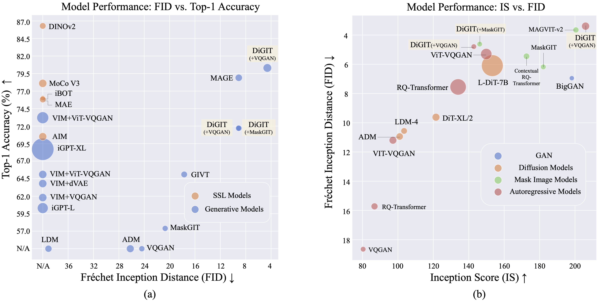
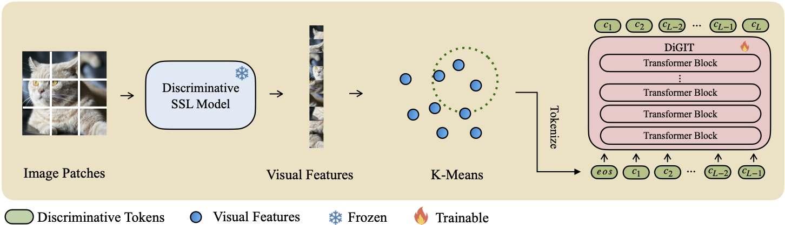

<h1 align="center"> Stabilize the Latent Space for Image Autoregressive Modeling: A Unified Perspective
</h1>

<p align="center">
<a href="https://arxiv.org/abs/2410.12490"></a>
</p>

<p align="center">
     
</p>

This is the official implementation of DiGIT accepted at NeurIPS 2024. The code will be available soon.


## Overview



We present **DiGIT**, an auto-regressive generative model performing next-token prediction in an abstract latent space derived from self-supervised learning (SSL) models. By employing K-Means clustering on the hidden states of the DINOv2 model, we effectively create a novel discrete tokenizer. This method significantly boosts image generation performance on ImageNet dataset, achieving an FID score of 4.59 for class-unconditional tasks and 3.39 for class-conditional tasks. Additionally, the model enhances image understanding, attaining a linear-probe accuracy of 80.3.


## Experimental Results

### Linear-Probe Accuracy on ImageNet


| Methods                          | \# Tokens   | Features | \# Params  | Top-1 Acc. $\uparrow$ |
|-----------------------------------|-------------|----------|------------|-----------------------|
| iGPT-L   | 32 $\times$ 32 | 1536     | 1362M      | 60.3                  |
| iGPT-XL   | 64 $\times$ 64 | 3072     | 6801M      | 68.7                  |
| VIM+VQGAN  | 32 $\times$ 32 | 1024     | 650M       | 61.8                  |
| VIM+dVAE  | 32 $\times$ 32 | 1024     | 650M       | 63.8                  |
| VIM+ViT-VQGAN  | 32 $\times$ 32 | 1024     | 650M       | 65.1                  |
| VIM+ViT-VQGAN  | 32 $\times$ 32 | 2048     | 1697M      | 73.2                  |
| AIM          | 16 $\times$ 16 | 1536     | 0.6B       | 70.5                  |
| **DiGIT (Ours)**                  | 16 $\times$ 16 | 1024     | 219M       | 71.7                  |
| **DiGIT (Ours)**                  | 16 $\times$ 16 | 1536     | 732M       | **80.3**               |

### Class-Unconditional Image Generation on ImageNet (Resolution: 256 $\times$ 256)

| Type  | Methods                             | \# Param | \# Epoch | FID $\downarrow$ | IS $\uparrow$  |
|-------|-------------------------------------|----------|----------|------------------|----------------|
| GAN   | BigGAN        | 70M      | -        | 38.6             | 24.70          |
| Diff. | LDM          | 395M     | -        | 39.1             | 22.83          |
| Diff. | ADM     | 554M     | -        | 26.2             | 39.70          |
| MIM   | MAGE              | 200M     | 1600     | 11.1             | 81.17          |
| MIM   | MAGE              | 463M     | 1600     | 9.10             | 105.1          |
| MIM   | MaskGIT      | 227M     | 300      | 20.7             | 42.08          |
| MIM   | **DiGIT (+MaskGIT)**                | 219M     | 200      | **9.04**         | **75.04**      |
| AR    | VQGAN         | 214M     | 200      | 24.38            | 30.93          |
| AR    | **DiGIT (+VQGAN)**                  | 219M     | 400      | **9.13**         | **73.85**      |
| AR    | **DiGIT (+VQGAN)**                  | 732M     | 200      | **4.59**         | **141.29**     |

### Class-Conditional Image Generation on ImageNet (Resolution: 256 $\times$ 256)


| Type  | Methods              | \# Param | \# Epoch | FID $\downarrow$ | IS $\uparrow$  |
|-------|----------------------|----------|----------|------------------|----------------|
| GAN   | BigGAN               | 160M     | -        | 6.95             | 198.2          |
| Diff. | ADM                  | 554M     | -        | 10.94            | 101.0          |
| Diff. | LDM-4                | 400M     | -        | 10.56            | 103.5          |
| Diff. | DiT-XL/2             | 675M     | -        | 9.62             | 121.50         |
| Diff. | L-DiT-7B             | 7B       | -        | 6.09             | 153.32         |
| MIM   | CQR-Trans            | 371M     | 300      | 5.45             | 172.6          |
| MIM+AR | VAR                 | 310M     | 200      | 4.64             | -              |
| MIM+AR | VAR                 | 310M     | 200      | 3.60* | 257.5* |
| MIM+AR | VAR                 | 600M     | 250      | 2.95* | 306.1* |
| MIM   | MAGVIT-v2            | 307M     | 1080     | 3.65             | 200.5          |
| AR    | VQVAE-2              | 13.5B    | -        | 31.11            | 45             |
| AR    | RQ-Trans             | 480M     | -        | 15.72            | 86.8           |
| AR    | RQ-Trans             | 3.8B     | -        | 7.55             | 134.0          |
| AR    | ViTVQGAN             | 650M     | 360      | 11.20            | 97.2           |
| AR    | ViTVQGAN             | 1.7B     | 360      | 5.3              | 149.9          |
| MIM   | MaskGIT              | 227M     | 300      | 6.18             | 182.1          |
| MIM   | **DiGIT (+MaskGIT)** | 219M     | 200      | **4.62**         | **146.19**     |
| AR    | VQGAN                | 227M     | 300      | 18.65            | 80.4           |
| AR    | **DiGIT (+VQGAN)**   | 219M     | 200      | **4.79**         | **142.87**     |
| AR    | **DiGIT (+VQGAN)**   | 732M     | 200      | **3.39**         | **205.96**     |

*: VAR is trained with classifier-free guidance while all the other models are not.


## Preparation

### Installation
1. Download the code
```shell 
git clone https://github.com/DAMO-NLP-SG/DiGIT.git
cd DiGIT
```

We use the VQGAN checkpoint realsed by [MAGE](https://drive.google.com/file/d/13S_unB87n6KKuuMdyMnyExW0G1kplTbP/view?usp=sharing).

Download the [DINOv2](https://github.com/facebookresearch/dinov2) SSL model.

2. Install `fairseq` via `pip install fairseq`.


### Dataset
Download [ImageNet](http://image-net.org/) dataset, and place it in your dataset dir `$PATH_TO_YOUR_WORKSPACE/dataset/ILSVRC2012`. Prepare the ImageNet validation set for FID evaluation against validation set:

```shell
python prepare_imgnet_val.py --data_path $PATH_TO_YOUR_WORKSPACE/dataset/ILSVRC2012 --output_dir imagenet-val
```
To evaluate FID against the validation set, do `pip install torch-fidelity`.

### Tokenizer
Extract the features of SSL and dump as the npy files. Apply K-Mneas alogrithm with [faiss](https://github.com/facebookresearch/faiss) to get the centroids.

```shell
bash preprocess/run.sh
```

### Training Scripts 

First train a GPT model with discriminative tokenizer and you can find the training scripts in `scripts/train_stage1_ar.sh` and the hyper-params are in `config/stage1/dino_base.yaml`. You can enable class conditional generation with `scripts/train_stage1_classcond.sh`.

Then train a pixel decoder (either AR model or NAR model) conditioned on discriminative tokens and you can find the autoregressive training scripts in `scripts/train_stage2_ar.sh` and NAR training scripts in `scripts/train_stage2_nar.sh`.

A folder named `outputs/EXP_NAME/checkpoints` will be created to save the checkpoints. The tensorboard files will be save at `outputs/EXP_NAME/tb`. The `outputs/EXP_NAME/train.log` will record logs. 

You can monitor the training process by using `tensorboard --logdir=outputs/EXP_NAME/tb`.


### Sampling Scripts

First sampling discriminative tokens with `scripts/infer_stage1_ar.sh`. 

Then we sample VQ tokens conditioned on discriminative tokens sampled before with `scripts/infer_stage2_ar.sh`.

A folder named `outputs/EXP_NAME/results` will be create to save the generated tokens and synthesized images.

### FID and IS evaluation
```shell 
python fairseq_user/eval_fid.py --results-path $IMG_SAVE_DIR --subset $GEN_SUBSET
```

### Linear Probe

```shell
bash scripts/train_stage1_linearprobe.sh
```

## License
This project is licensed under the MIT License - see the [LICENSE](LICENSE) file for details.


## Citation

If you find our project useful, hope you can star our repo and cite our work as follows. 

```bibtex
@inproceedings{
digit,
title={Stabilize the Latent Space for Image Autoregressive Modeling: A Unified Perspective},
author={Yongxin Zhu, Bocheng Li, Hang Zhang, Xin Li, Linli Xu, Lidong Bing},
booktitle={The Thirty-eighth Annual Conference on Neural Information Processing Systems},
year={2024},
url={https://openreview.net/forum?id=waQ5X4qc3W}
}
```
